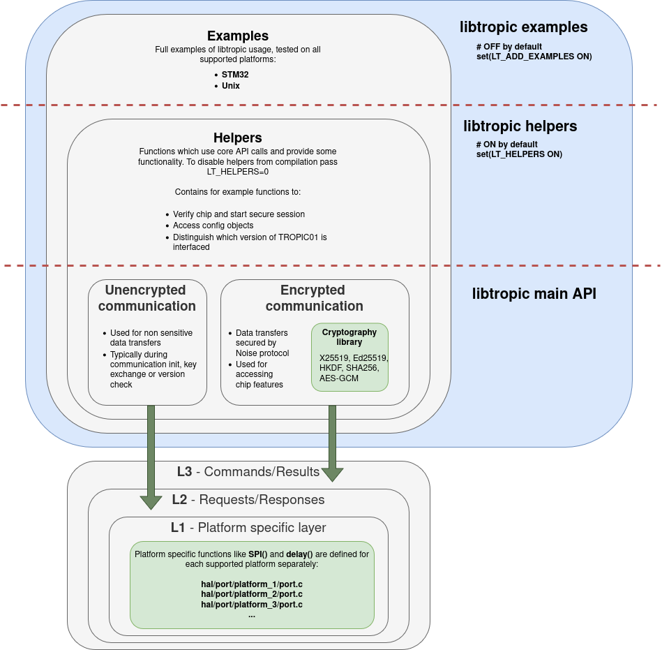

# Libtropic Architecture
!!! bug
    Add more info?

Libtropic is a standalone library expected to be used within a parent project.

The following figure depicts libtropic's architecture:

!!! bug
    The figure includes outdated information. 

