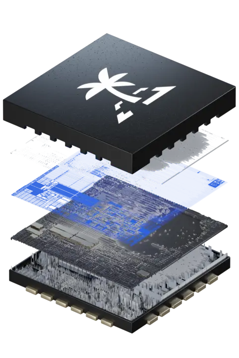

# Introduction

Welcome to the documentation page for **libtropic**, the official C library for **TROPIC01** chip. This guide will help you get started with building applications using **TROPIC01** and **libtropic**.

[TOC]

## Documentation Structure
This documentation has the following structure:

- [API Reference](doxygen/build/html/index.html): API documentation generated with Doxygen,
- [Examples](examples/index.md): examples showing basic libtropic usage,
- [Tests](tests/index.md): functional and unit tests,
- [For Developers](for_developers/index.md): library architecture, adding new support, etc.
- [Other](other/index.md): information about TROPIC01 Model, provisioning data, etc.

## Getting TROPIC01

{ width="200" }

`TROPIC01` is currently available in several form factors - heck out the [TROPIC01 repository](https://github.com/tropicsquare/TROPIC01), where you can find datasheets, documentation and ordering instructions.

## Platform Repositories
We offer platform repositories, implementing the libtropic port:

- [libtropic-stm32](https://github.com/tropicsquare/libtropic-stm32)
- [libtropic-linux](https://github.com/tropicsquare/libtropic-linux)

All of these repositories consist of:

- libtropic as a git submodule
- directories for supported platforms
    - `CMakeLists.txt`
    - include directory
    - source directory with `main.c`
    - additional files (readme, scripts, ...)

For more detailed info, refer to the aforementioned platform repositories.

Besides that, we offer the [libtropic-util](https://github.com/tropicsquare/libtropic-util) repository, which implements a CLI based utility for executing TROPIC01's commands.

## Adding libtropic to Existing Project

How can you add libtropic to your existing project?

First, please read the entire documentation so you get familiar with how library works.

Then we recommend to add libtropic as a submodule. Libtropic uses CMake build system, therefore it could be added to compilation of existing CMake projects in a following way:

```
# CMakeLists.txt file

# Set path of libtropic submodule
set(PATH_LIBTROPIC "libtropic/")

# This switch will expose not only core library functions, but also helper functions (recommended)
set(LT_HELPERS ON)

# This switch exposes also functions and tests containing example of usage.
# Might be a good starting point.
#set(LT_BUILD_EXAMPLES ON)
#set(LT_BUILD_TESTS ON)

# It is necessary to set provider of cryptography functions
# Use trezor crypto as a source of backend cryptography code
set(LT_USE_TREZOR_CRYPTO ON)

# Add path to libtropic's repository root folder
add_subdirectory(${PATH_LIBTROPIC} "libtropic")

### Linking

target_link_options(produced_binary PRIVATE <your_linker_flags>)

```


!!! note
    Exact CMake calls depend on configuration of a project into which libtropic is being added. For more inspiration, have a look at the aforementioned platform repositories.

!!! note
    We offer multiple CMake options - to see all of them, go to the beginning of the `CMakeLists.txt` file in the repository's root directory.


## Do you use Makefile instead of CMake?

In this case, you have to add list of all libtropic `*.c` and `*.h` files manually to your Makefile and then for all CMake ON options (located in libtropic's root `CMakelists.txt`) you define `-D` switch in your Makefile.

Then do the same for files used in `vendor/trezor_crypto/`.

## Logging
The library contains a logging functionality, which is disabled by default (unless you compile tests or examples).

You may find it useful to enable logging during libtropic evaluation or integration. There are five logging levels:

- none (default unless compiling tests or examples),
- error,
- warning,
- info,
- debug.

To switch the logging level, you can use a following switch: `-DLT_LOG_LVL`. The table below summarizes all
logging levels and a switch corresponding to each level.

| Level   | CMake switch           |
|---------|------------------------|
| none    | `-DLT_LOG_LVL=None`    |
| error   | `-DLT_LOG_LVL=Error`   |
| warning | `-DLT_LOG_LVL=Warning` |
| info    | `-DLT_LOG_LVL=Info`    |
| debug   | `-DLT_LOG_LVL=Debug`   |
