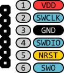

# libtropic bulk platform tester
For now, this document is only a colletion of notes.

JTAG interface on F439ZI is mapped as:
- TCK: PA14
- TDI: PA15
- TDO: PB3
- TMS: PA13

Useful links:
- [Nice F439ZI pinout](https://os.mbed.com/platforms/ST-Nucleo-F429ZI/)

## SWD vs JTAG
This is just copied from internal issue. Might be useful later.

### SWD approach
On Nucleo-144 boards (which we use with @ppolach for development), there is a built-in ST-Link v2. This can be directly use via USB. But also there is a header which exposes the SWD interface for external debuggers. This can be enabled by removing jumpers from CN4.

Pinout of ST-Link's SWD:

More info [here](https://stm32-base.org/guides/connecting-your-debugger.html).

OpenOCD config for SWD mode [here](https://github.com/openocd-org/openocd/blob/master/tcl/board/st_nucleo_f4.cfg).

Note: Because the SWD uses TMS as a bi-directional pin, it is not possible to use boards with unidirectional buffers -- there should be either bi-directional, or two of these.

### JTAG approach
JTAG interface is exposed on pins without a header. In STM32F439xx [datasheet, p66, 67, 69](https://www.st.com/resource/en/datasheet/stm32f439zi.pdf) there are pin names corresponding to the JTAG interface -- a header have to be soldered there.

- TCK: PA14
- TDI: PA15
- TDO: PB3
- TMS: PA13

Observation: when both jumpers on CN4 are present, TCK, TDI and TMS are accessible from the CN6 pinout on the ST-Link. However, when using these pins to access JTAG, the ST-Link must not be powered on! As such, USB power must not be used and 3.3V power must be provided to the Nucleo directly. 3.3V, not any other (VIN, 5V) to keep ST-Link powered down. So, we may say that it is possible to use existing headers. However, PB3 still needs to be soldered, so I think it is more convenient to solder all of them, so we are able to use the ST-Link part for USB powering the Nucleo.

So: after all headers are soldered, jumpers need to be removed from the ST-Link for a case we want to use USB power to disconnect ST-Link from pins that are shared with JTAG.

### Comparison
JTAG supports daisy chaining natively. This means we can program multiple JTAG-supported targets without any multiplexing or using multiple FTDI chips. This may make our board a bit cheaper. Also, it is apparently faster?

SWD requires only two pins and it is a native way of programming ARM CPUs. However, there is usually a JTAG present as well.